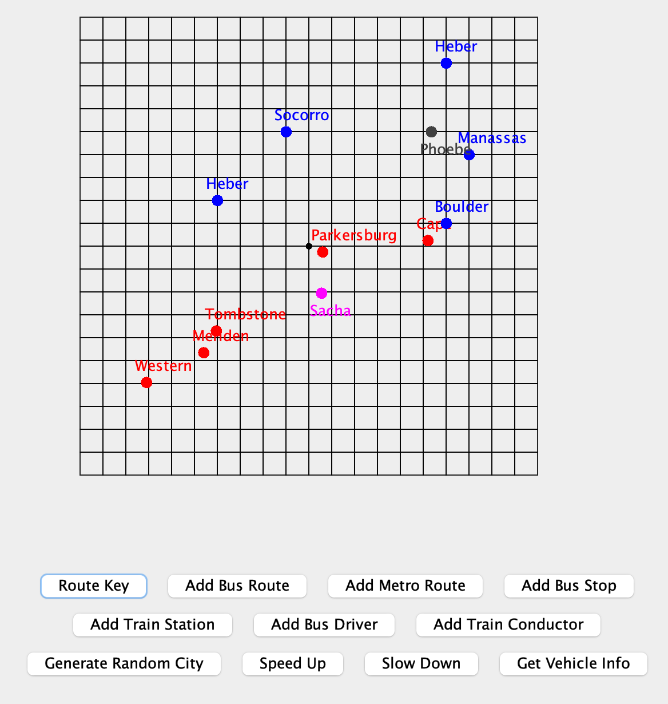

# Portfolio
Highlight of some work I have completed over my four years at Pitt

- [Transit Manager](https://github.com/olivias27/Portfolio/tree/main/src/transit): My final project for one of my computer science classes was to build a fully functional transit manager GUI. Over the semester, we worked to design a transit manager to determine how many people were at stops/stations, how full a bus/train is, what the next stop/station is, and how many people got off at stops/stations. At the end of the semester, our job was to create a GUI, which is a way to visualize the output.  One of our requirements was that we had to make our code so that buses could only travel on the grid, which represents streets, while trains could travel randomly. The route key button tells the user that the Blue dot is a bus stop, red is a train station, dark gray is a bus, and pink is a train. The add bus route and add metro route add three new stops/stations and one new bus/train to our visual. The add bus stop/train station buttons allow you to add a new stop to a pre-existing station/stop, and let you select x and y-coordinates between -10 and 10. If the user puts in a number outside of the range, they will receive an error code and be asked for new input. Since buses can only travel on roads, the input must be a whole number and if not, it will error out as well. Adding a train conductor or bus driver functions similarly to the bus route and train station buttons, adding a new bus or train to a pre-existing route. Generate random city will clear the existing grid and add a randomized number between 1-15 of stops, stations, drivers, and conductors to the board. The speed up and slow down button work to either speed up or slow down how fast the buses and trains are going. I did this by implementing a tick system. Finally, the get vehicle info outputs information about all vehicles on the map. One of the outputs may look like the image below . 
- [1501 Projects](projects): Here are two projects I worked on in my Data Structures and Algorithms 2 class; A Binary Search Tree and a Color Quantizer.
- Capstone Project: I am currently working with a team with five of my fellow students to develop a data pipeline for a local company. Code cannot be provided for legal purposes.
- Sports Analytics: I am also currently working on a project to analyze historical gymnastics data in order to predict team success/"ten-ness". More information will be added as I complete the project.
